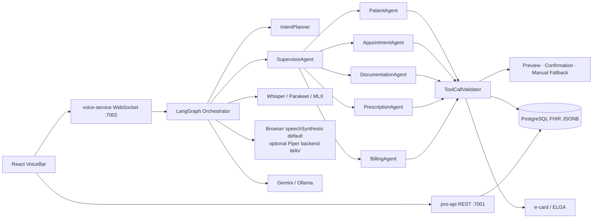

# DoclineAi

DoclineAi ist heute ein On-Premise-Prototyp fuer eine agentengesteuerte, voice-first Praxisverwaltungssoftware. Der strategische Nordstern ist groesser: Docline soll zu einem vollstaendig autonomen klinischen Betriebssystem werden, in dem die Konsultation das primaere Interface ist und die GUI vor allem als Review-, Steuerungs- und Vertrauensebene dient.

Die aktuellen Kernworkflows werden dabei bewusst auf einen gemeinsamen Dreiklang gehaertet: manueller Pfad, assisted path sowie Preview-, Confirmation- und Execute-Contract mit Confidence-, Unsicherheits- und Fallback-Signalen.

Der aktuelle Repo-Stand ist noch naeher an einem lokalen, sicheren, FHIR-nativen PVS-Prototypen als an dieser Zielvision. Die geplante Transformation folgt deshalb vier Iterationen:

1. funktionsfaehige Basis-PVS
2. Oesterreich-First mit SVC / e-card
3. ELGA-Integration
4. Umbau zum autonomen klinischen Betriebssystem

Die kanonische Beschreibung dieser Zielarchitektur liegt in [docs/autonomous-clinical-os.md](docs/autonomous-clinical-os.md).

## Tech-Stack

- Frontend: React 18, TypeScript, Vite, TailwindCSS v4
- Backend: Python 3.12, FastAPI, LangGraph-Orchestrator mit IntentPlanner, SupervisorAgent und Domain-Sub-Agenten
- Daten: PostgreSQL 16, FHIR R4 als JSONB plus Suchindizes, optionaler HAPI-FHIR-Sidecar
- Voice/Ambient: getrennter `voice-service` auf Port 7002, Whisper als Docker-Default, Parakeet als nativer Core-Default, MLX-Whisper fuer Apple Silicon, Browser-speechSynthesis fuer Sprachausgabe; Ambient-Segmente erzeugen reviewpflichtige Kandidaten und persistente Supervision-Queue-Items
- LLM: Google Gemini (Standard, Cloud) oder Ollama lokal (On-Premise-Fallback)
- Deployment: Docker Compose fuer On-Premise-Betrieb

## Lokales Setup

### Coworker-Setup ohne Programmierkenntnisse

Fuer lokale Demo-Tests auf einem neuen Rechner reichen Docker Desktop und VS Code.
Danach im Projektordner ausfuehren:

```bash
./setup_coworker.sh
```

Unter Windows (PowerShell) ist das Gegenstueck:

```powershell
.\setup_coworker.ps1
```

Das Skript startet Docline komplett in Docker, richtet die lokale Datenbank ein,
spielt die Testpatienten ein und legt die Runtime-Logins
`marc@docline.ai` sowie `info@docline.ai` mit dem Passwort `docline.ai` in der
Docline-Organisation an.

Spaetere Starts laufen ueber:

```bash
./start_coworker.sh
```

Unter Windows (PowerShell):

```powershell
.\start_coworker.ps1
```

Eine Schritt-fuer-Schritt-Anleitung liegt in [docs/local-coworker-setup.md](docs/local-coworker-setup.md).

### Entwickler-Setup

```bash
cd Docline
./start.sh
```

Unter Windows (PowerShell):

```powershell
cd Docline
.\start.ps1
```

Optional mit Nginx auf Port 80/443:

```bash
cd Docline
./start.sh --with-nginx
```

Unter Windows (PowerShell):

```powershell
cd Docline
.\start.ps1 --with-nginx
```

Beim ersten Start legt das Skript bei Bedarf eine `.env` aus `.env.example` an,
startet PostgreSQL und HAPI FHIR via Docker Compose,
prueft bei `LLM_PROVIDER=ollama` lokales Ollama auf dem Host und zieht das in
`LLM_MODEL` konfigurierte Ollama-Modell automatisch nach. Bei `LLM_PROVIDER=gemini`
oder anderen Cloud-Providern wird der lokale Ollama-Start uebersprungen.
Mit `BACKEND_RUNTIME=auto` und `FRONTEND_RUNTIME=auto` startet das Skript
Backend und Frontend nativ auf dem Host und laesst nur Datenbank und FHIR in
Docker. Das vermeidet unnoetige Container fuer lokale Entwicklung und die
schweren Linux-Container-Abhaengigkeiten fuer STT-Ausfuehrung auf dem Host.
Der Backend-Build installiert `openai-whisper` nur noch dann, wenn
`STT_PROVIDER=whisper` gesetzt ist; mit `STT_PROVIDER=parakeet` bleibt der
schwere Whisper/Torch-Stack draussen.

Fuer nativen Parakeet-Betrieb auf Apple Silicon installiert das Startskript bei
Bedarf zusaetzlich die in [backend/requirements.native.txt](backend/requirements.native.txt)
gepinnten `torch`-/`torchaudio`-/NeMo-ASR-Abhaengigkeiten in `backend/.venv`.
Fuer den schnelleren nativen Apple-Silicon-Pfad kann `STT_PROVIDER=mlx` gesetzt
werden; dann nutzt das Startskript [backend/requirements.native.mlx.txt](backend/requirements.native.mlx.txt)
und `MLX_WHISPER_MODEL` (Default `mlx-community/whisper-large-v3-turbo`).
Der Docker-Voice-Service bleibt bewusst bei `VOICE_STT_PROVIDER=whisper` und
speichert Whisper-Modelle unter `WHISPER_CACHE_DIR`.

Wenn Parakeet/NeMo oder MLX lokal noch nicht installiert ist, faellt der native
Voice-/Backend-Prozess fuer STT automatisch auf lokales Whisper zurueck.

Fuer eine bessere lokale Antwortstimme kann `TTS_ENGINE=piper` gesetzt werden.
Das native Startskript installiert dann die optionalen Abhaengigkeiten aus
[backend/requirements.tts.txt](backend/requirements.tts.txt). Lege ein deutsches
Piper-Modell samt JSON-Konfiguration z. B. aus `rhasspy/piper-voices` unter
`backend/models/piper/` ab oder setze `PIPER_MODEL_PATH` und
`PIPER_CONFIG_PATH` explizit. Der lokale Default ist die deutsche weibliche
Piper-Stimme `de_DE-kerstin-low`. Relative Piper-Pfade werden vom Voice-Service auch
gegen `PVS_CORE_PATH` aufgeloest, also im nativen Setup gegen `backend/`. Wenn
Piper oder das Modell fehlt, bleibt die Frontend-Web-Speech-Ausgabe als Fallback
aktiv.

Bei `LLM_PROVIDER=ollama` ist ein lokal installiertes Ollama auf dem
Host-Rechner erforderlich. Unter macOS startet `./start.sh` die Ollama-App bei
Bedarf mit.

Fuer Gemini muss zusaetzlich `GEMINI_API_KEY` in der `.env` gesetzt sein (`GOOGLE_API_KEY` wird als Legacy-Alias akzeptiert).
Vor einem nativen Backend-Neustart bereinigt `start.sh` ausserdem verwaiste
`uvicorn app.main:app --reload`-Listener auf Port 7001, aktualisiert bei
Bedarf fehlende Pakete in `backend/.venv` und schreibt die nativen
Prozess-Logs nach `.backend.log` und `.frontend.log`.
`--with-nginx` setzt derzeit Docker fuer Backend und Frontend voraus.

Manuell bleibt der direkte Compose-Start weiterhin moeglich:

```bash
cd Docline
cp .env.example .env
# nur benoetigt fuer LLM_PROVIDER=ollama
ollama serve
docker compose --env-file .env -f docker/docker-compose.yml up --build
```

Weitere Hilfsskripte:

```bash
cd Docline
./stop.sh
./restart.sh
```

Unter Windows (PowerShell):

```powershell
cd Docline
.\stop.ps1
.\restart.ps1
```

Im aktuellen VS-Code-Workspace stehen ausserdem Tasks unter `Terminal > Run Task`
bereit, z. B. `DoclineAi: Start`, `DoclineAi: Start With Nginx` und `DoclineAi: Stop`.

Danach sind verfuegbar:

- Frontend: <http://localhost:3000>
- pvs-api (Core): <http://localhost:7001/docs>
- voice-service (WS/STT): <http://localhost:7002/health>
- HAPI FHIR: <http://localhost:8080/fhir>
- Ollama lokal: <http://localhost:11434>

## Services: pvs-api und voice-service

DoclineAi ist in zwei getrennte, eigenstaendig startbare Python-Services geteilt:

- **`pvs-api`** ([backend/](backend/), Port 7001) – das Kern-PVS / Clinical PMS
  (Auth, Patient, Termine, Encounter, Doku, Abrechnung, ELGA, e-card ...). Reines REST.
  Haengt **nicht** vom Voice-Pfad ab; der manuelle Fallback bleibt erhalten.
- **`voice-service`** ([apps/voice-service/](apps/voice-service/), Port 7002) –
  Live-Audio, WebSocket-Streaming, STT und Ambient-Vorbereitung. Darf ausfallen,
  ohne das Kern-PVS unbenutzbar zu machen. Committet keine klinischen Inhalte
  ohne explizite Bestaetigung.

`./start.sh` startet beide; `./apps/voice-service/run.sh` startet nur den
voice-service nativ. Details und Boundary-Regeln:

- [docs/architecture/current-architecture.md](docs/architecture/current-architecture.md)
- [docs/architecture/service-boundaries.md](docs/architecture/service-boundaries.md)
- [docs/status/refactor-status.md](docs/status/refactor-status.md)

## Architektur



## Module

- [Heute / Today Workspace](frontend/src/modules/today) als operativer Stimmeinstieg mit Agenda, Inbox, Aufgaben und Praxisstatus
- [Patientenverwaltung](frontend/src/modules/patients) mit Stammdaten, Allergien, Coverage/Versicherung und longitudinalem Patient Chart
- [Terminplanung](frontend/src/modules/appointments) mit Kalender, Quick Book, Waitlist und Scheduling-Administration
- [ePA / Encounter-Workspace](frontend/src/modules/epa) mit Anamnese/Befund/Diagnose/Therapie-Dokumentation, Artefakt-Lifecycle und Billing-Events
- [Befunde / Dokumente](frontend/src/modules/documents) mit Dokumentdetail- und Voice-Preview-Flows
- [Verordnungen und e-card/ELGA](frontend/src/modules/prescriptions)
- [Abrechnung](frontend/src/modules/billing)
- [Labor und Geraete](frontend/src/modules/laboratory)
- [Kommunikation](frontend/src/modules/communications)
- [Controlling](frontend/src/modules/controlling)
- [Administration](frontend/src/modules/administration) fuer Organisation, User, Praxis, Scheduling und Security

## Backend

- FastAPI Einstieg: [backend/app/main.py](backend/app/main.py)
- Orchestrator + LangGraph-Graph: [backend/app/agents/orchestrator.py](backend/app/agents/orchestrator.py)
- IntentPlanner: [backend/app/agents/intent_planner.py](backend/app/agents/intent_planner.py)
- SupervisorAgent: [backend/app/agents/supervisor_agent.py](backend/app/agents/supervisor_agent.py)
- ToolCallValidator: [backend/app/agents/tool_call_validator.py](backend/app/agents/tool_call_validator.py)
- Domain-Sub-Agenten: [backend/app/agents/sub_agents/](backend/app/agents/sub_agents/)
- Auth + Session: [backend/app/api/v1/auth.py](backend/app/api/v1/auth.py), [backend/app/api/v1/session.py](backend/app/api/v1/session.py), [backend/app/services/auth_service.py](backend/app/services/auth_service.py) und [backend/app/services/session_identity.py](backend/app/services/session_identity.py)
- Patient Chart: [backend/app/api/v1/patients.py](backend/app/api/v1/patients.py) und [backend/app/services/patient_service.py](backend/app/services/patient_service.py)
- Encounter-Workspace: [backend/app/api/v1/epa.py](backend/app/api/v1/epa.py) und [backend/app/services/encounter_workspace_service.py](backend/app/services/encounter_workspace_service.py)
- Ambient Supervision, Plans und Transcript-Turns: [backend/app/services/ambient_supervision_queue.py](backend/app/services/ambient_supervision_queue.py), [backend/app/services/ambient_plan_store.py](backend/app/services/ambient_plan_store.py), [backend/app/services/voice_transcript_service.py](backend/app/services/voice_transcript_service.py), [backend/app/agents/ambient_supervision.py](backend/app/agents/ambient_supervision.py) sowie die Migrationen bis [backend/alembic/versions/0021_medication_change_proposal.py](backend/alembic/versions/0021_medication_change_proposal.py)
- Voice-Service: [apps/voice-service/voice_app/ws.py](apps/voice-service/voice_app/ws.py), [apps/voice-service/voice_app/gateway.py](apps/voice-service/voice_app/gateway.py) und [apps/voice-service/voice_app/stt.py](apps/voice-service/voice_app/stt.py)
- Practice Foundation + Policy: [backend/app/api/v1/practices.py](backend/app/api/v1/practices.py), [backend/app/api/v1/consents.py](backend/app/api/v1/consents.py), [backend/app/api/v1/break_glass.py](backend/app/api/v1/break_glass.py) und [backend/app/services/policy_service.py](backend/app/services/policy_service.py)
- Scheduling + Praxis-Workspace: [backend/app/api/v1/appointments.py](backend/app/api/v1/appointments.py), [backend/app/services/scheduling_service.py](backend/app/services/scheduling_service.py), [backend/app/api/v1/communications.py](backend/app/api/v1/communications.py) und [backend/app/api/v1/controlling.py](backend/app/api/v1/controlling.py)
- e-card / ELGA-Service: [backend/app/services/ehealth_service.py](backend/app/services/ehealth_service.py)
- FHIR Migration: [backend/alembic/versions/0001_create_fhir_resources.py](backend/alembic/versions/0001_create_fhir_resources.py)
- Persistenz/Audit Migration: [backend/alembic/versions/0002_persistence_context_audit.py](backend/alembic/versions/0002_persistence_context_audit.py)

### Testdaten seeden

Fuer lokale UI-/API-Tests gibt es einen deterministischen Seeder, der alle persistierten App-Tabellen befuellt: Organisation, Standorte, Practitioner-Profile, Rollen, Consents, Break-Glass, FHIR-Ressourcen, Billing-nahe Ressourcen, Audit-Trail und Dokumente.

Der Seeder legt aktuell u. a. 5 Aerzte, weiteres Personal, 12 Patienten und pro Patient mehrere Begegnungen, Termine, Medikationen, Labor-/Arztbrief-Dokumente, Claims und Invoices an.

```bash
# nur Plan und Mengen pruefen
./seed_test_data.sh --dry-run

# Seed-Daten in die konfigurierte DB schreiben
./seed_test_data.sh

# vorhandene Seed-Daten zuerst loeschen und dann frisch aufbauen
./seed_test_data.sh --reset-seeded
```

Unter Windows (PowerShell) heissen die Entsprechungen:

```powershell
.\seed_test_data.ps1 --dry-run
.\seed_test_data.ps1
.\seed_test_data.ps1 --reset-seeded
```

Der Wrapper liest bevorzugt die Root-`.env`; falls sie fehlt, faellt er fuer lokale Dev-Defaults auf `.env.example` zurueck.
Voraussetzungen: `DATABASE_URL` zeigt auf deine lokale Postgres-Instanz und die Migrationen sind bereits auf `head`.

## Betriebsfaehigkeit

- Backend ist per Docker standardmaessig unter `http://localhost:7001` erreichbar und fuehrt beim Containerstart `alembic upgrade head` aus.
- FHIR-Kernressourcen sowie Encounter-Workspace/Billing-Events werden in PostgreSQL gespeichert; HAPI FHIR laeuft optional daneben, ist aber nicht die primaere App-Persistenz.
- `GET /api/v1/session/me` loest die aktuelle Runtime-Identitaet inklusive Permissions, Practitioner-Kontext und `available_tenants` fuer den Frontend-Store auf.
- `GET /api/v1/patients/{patient_id}/chart` aggregiert Identifier, Fachsektionen, Timeline und Provenienz fuer den longitudinalen Patientenkontext.
- `/api/v1/epa/encounters/{encounter_id}/workspace` sowie die zugehoerigen Dokumentations-, Artefakt-, Artefaktstatus-, Billing-, Ambient-, Supervision-Queue- und Finalize-Endpunkte tragen den aktuellen Encounter-Workspace.
- `/api/v1/epa/ambient/plans`, `/api/v1/epa/supervision-queue/{item_id}/execute` und `/api/v1/voice-transcripts` persistieren Ambient-Plans, Review-/Execute-Entscheidungen und den durchgaengigen Sprach-/Text-Transkriptverlauf.
- Terminplanung nutzt neben FHIR-Appointments konkrete Scheduling-Admin-Endpunkte fuer Ressourcen, Visit Types, Availability Rules und Calendar Blocks.
- Patientenvitalwerte laufen ueber `/api/v1/patients/vitals/catalog`, `/api/v1/patients/{patient_id}/vitals` und die PatientVitals-UI; Laborbefunde koennen kritische Werte in die persistente `/api/v1/laboratory/alerts` Queue heben.
- Der lokale Verordnungsworkflow umfasst `/api/v1/prescriptions`, `/{id}/issue`, `/{id}/status`, `/{id}/document` und `/api/v1/prescriptions/safety-check`; dokumentbasierte Medikationsaenderungen werden ueber `/api/v1/medication-proposals` geprueft, freigegeben oder abgelehnt.
- Practice-Foundation-, Consent- und Break-Glass-Endpunkte liegen unter `/api/v1/practice-foundation`, `/api/v1/consents` und `/api/v1/break-glass`.
- Voice-Previews tragen fuer die aktuellen Kernworkflows jetzt Confidence-, Unsicherheits- und Manual-Fallback-Metadaten; Bestaetigungen werden serverseitig ueber `preview_id` gebunden.
- Der Voice-Pfad nutzt fuer einfache Tool-Treffer einen Single-Call-Fast-Path (`VOICE_FAST_PATH`) und fuer konkrete Laborwertfragen einen deterministischen Direktpfad auf `documentation_get_lab_value`.
- Der Ambient-Voice-Pfad unterstuetzt Reconnect/Resume (`session_resume`/`session_welcome`), Session-Health-Telemetrie (`session_health`, `GET /health/ambient`) sowie laufende VAD-/Segmentierungssteuerung (`vad_control`/`vad_config`).
- Patientensuche zeigt bei unsicheren Treffern Kandidaten statt eine Akte blind zu oeffnen; Terminabfragen beruecksichtigen Patient, Ressource und Datumsfenster.
- Neue bestaetigungspflichtige Voice-Previews decken Patient-Stammdaten-Aenderungen und Kalender-Sperrzeiten ab.
- Read-Tools decken inzwischen Dokumentlisten/-suche, Laborwert-Verlauf, Medikamentenliste und Aktenvolltextsuche ab.
- Ambient-Preview-Schritte koennen in `fhir.ambient_supervision_queue` persistiert werden; Queue-Items referenzieren Kandidat, Step, Preview, Risiko, Policy-Status, Evidenz und spaetere Reviewer-/Execution-Ergebnisse.
- Lokale Entwicklung setzt explizit `AUTH_MODE=dev`; nur dann akzeptiert das Backend Dev-Identitaet aus `x-user-id`/`x-user-roles` oder den konfigurierten Default-Dev-Rollen. Produktion laeuft mit `AUTH_MODE=runtime`, `AUTH_REQUIRED=true` und `VITE_AUTH_MODE=runtime`.
- Runtime-Auth nutzt JWT-Bearer-Access-Tokens plus serverseitig widerrufbare Refresh-Sessions. Die Endpunkte liegen unter `/api/v1/auth/register`, `/api/v1/auth/login`, `/api/v1/auth/refresh`, `/api/v1/auth/logout`, `/api/v1/auth/select-tenant`, `/api/v1/auth/invitations` und `/api/v1/auth/users`.
- Register unterstuetzt Tenant-Bootstrap mit initialem Admin sowie Invite-Beitritt zu bestehenden Organisationen/Praxen. TTLs werden ueber `ACCESS_TOKEN_EXPIRE_MINUTES`, `REFRESH_TOKEN_EXPIRE_DAYS` und `AUTH_INVITATION_EXPIRE_DAYS` gesteuert.
- Der Today-Workspace aggregiert Praxismetriken, Agenda, Waiting Room, Aufgaben und Inbox aus den Controlling- und Communications-Endpunkten als Stimmeinstieg.
- KI- und manuelle Aktionen landen im Audit-Trail unter `/api/v1/audit`.
- Agentenmetriken stehen unter `/api/v1/monitoring/metrics`.
- Hoerbare Assistentenantworten kommen standardmaessig aus der Frontend-Web-Speech-API; mit `TTS_ENGINE=piper` werden lokale Backend-WAV-Antworten bevorzugt und Browser-TTS bleibt Fallback.
- e-card/ELGA-Ausfaelle werden in `OFFLINE_QUEUE_PATH` als JSONL persistiert und koennen ueber `/api/v1/ehealth/offline-queue` geprueft werden.
- Das deutschsprachige Voice-Eval-Set liegt in [backend/tests/evaluation/german_voice_commands.json](backend/tests/evaluation/german_voice_commands.json).

## Produktstatus und Roadmap

Aktueller Stand:

- voice-first, local-first, agentic PVS-Prototyp
- staerkste End-to-End-Flows heute in Patienten-, Termin-, Encounter-Workspace- und ausgewaehlter Dokumentationslogik
- Today-Workspace, Scheduling-Administration, Dokumenten-/Artefakt-Lifecycle, Patient-Stammdaten, Allergien und Coverage sind als konkrete UI/API-Surfaces vorhanden
- Vitalwerte mit Trendansicht, Labor-Alert-Queue, lokaler Verordnungsworkflow mit Safety-Check, Medikationsaenderungs-Vorschlaege aus Dokumenten und Voice-Transcript-Verlauf sind konkrete UI/API-Surfaces
- Praxisstammdaten, Rollen, Consent, Break-Glass und Policy-Primitiven sind als konkrete Repo-Surfaces vorhanden
- Runtime-Auth, Tenant-Wechsel und Session-Identity sind echte Produktpfade und nicht mehr nur Dev-Scaffolding
- Kernworkflows tragen inzwischen explizite Confidence-, Unsicherheits- und Manual-Fallback-Signale durch den Preview-/Confirmation-Contract
- Voice-Resultate, Patientenkandidaten, Dokument-/Laborergebnisse und Speech-Cancellation sind im Frontend als konkrete Nutzerpfade verdrahtet
- ausgewählte AmbientPlanSteps werden nicht mehr nur transient angezeigt, sondern als persistente Supervision Queue Items vorbereitet
- Billing ist als Domain im Orchestrator verdrahtet, degradiert ohne Tool-Match aber derzeit noch kontrolliert in den manuellen Billing-Workspace
- klinische Schreibaktionen bleiben bestaetigungspflichtig

Zielbild:

- ambientes, passives Zuhoeren waehrend der Konsultation
- policy-gebundene autonome Workflow-Orchestrierung
- Post-GUI-Supervision statt GUI-first-Bedienung
- strukturierte, interoperable klinische Daten als Betriebsgrundlage

Noch offen (Hausarzt-Alltag, AT-spezifisch): Honorarnoten/Wahlarzt-Rueckerstattung und
AT-Kassenabrechnung, Registrierkasse/RKSV, e-Impfpass, Recall/Praevention und Chronikermanagement,
Online-Selfservice (Online-Termine, digitale Anamnese, SMS-/E-Mail-Reminder), Telemedizin sowie
mobile Hausbesuch-Nutzung. Diese Luecken sind in der Gap-Analyse
[docs/austria-hausarzt-gap.md](docs/austria-hausarzt-gap.md) erfasst und als Milestone
M9 - Austria GP Daily-Value eingeplant.

Die Gesamtplanung steht in [docs/autonomous-clinical-os.md](docs/autonomous-clinical-os.md). Der erweiterte Issue-Backlog fuer die naechsten Clinical-OS-Slices (M5-M9) steht in [docs/clinical-os-backlog.md](docs/clinical-os-backlog.md). Die Hausarzt-Luecken-Analyse gegen den oesterreichischen PVS-Standard liegt in [docs/austria-hausarzt-gap.md](docs/austria-hausarzt-gap.md).

## Regulatory and Market Roadmap

- [Oesterreich SVC / e-card Integration](docs/regulatory/austria-svc.md)
- [Oesterreich ELGA Integration](docs/regulatory/austria-elga.md)
- [Oesterreich e-Impfpass Integration](docs/regulatory/austria-e-impfpass.md)
- [EU AI Act Compliance](docs/regulatory/eu-ai-act.md)
- [gematik KOB-Zertifizierung fuer spaetere Deutschland-Erweiterung](docs/regulatory/gematik-kob.md)
- [KBV-Primaersystemzertifizierung fuer spaetere Deutschland-Erweiterung](docs/regulatory/kbv-certification.md)

## Entwicklungsregeln

- DSGVO first: Patientendaten verlassen die lokale Praxisumgebung nicht ohne explizite, dokumentierte Konfiguration.
- Arzt bestaetigt immer: klinisch relevante Aktionen bleiben bestaetigungspflichtig.
- Audit-Trail: manuelle und KI-initiierte Aktionen werden nachvollziehbar protokolliert.
- Offline-faehig: Kernprozesse muessen ohne Internet weiterarbeiten.
- e-card/ELGA-fehlertolerant: e-Rezept, Krankmeldung und sichere Nachricht nutzen Queues fuer Wiederholung bei Konnektor-Ausfall.
- Barrierefrei: zentrale Workflows sind per Tastatur bedienbar.
- Autonomie bleibt policy-gebunden: hoeherer Automatisierungsgrad ersetzt nicht Signaturen, Rollen oder regulatorische Freigaben.
